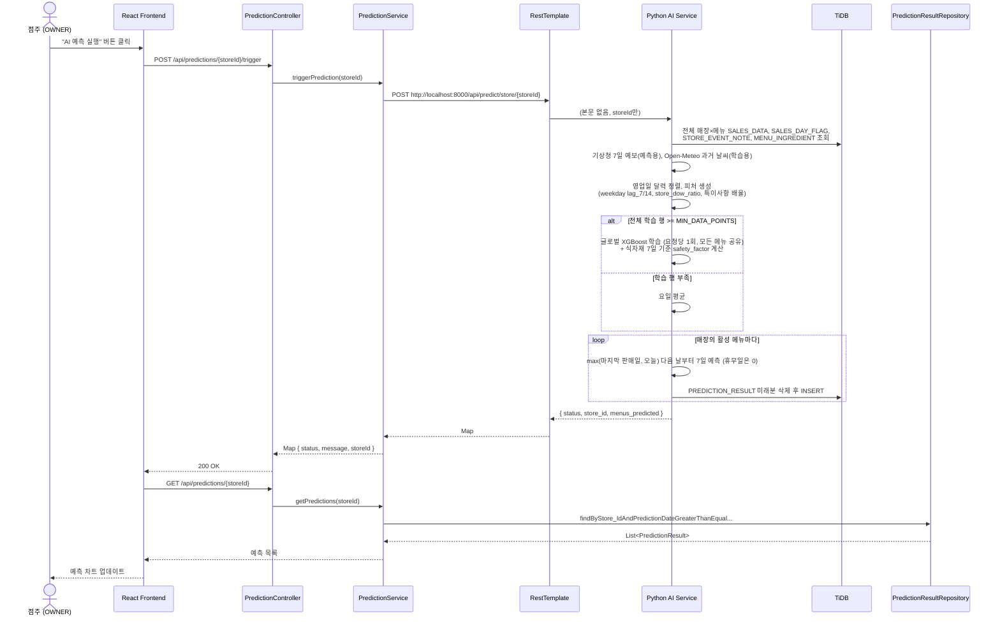
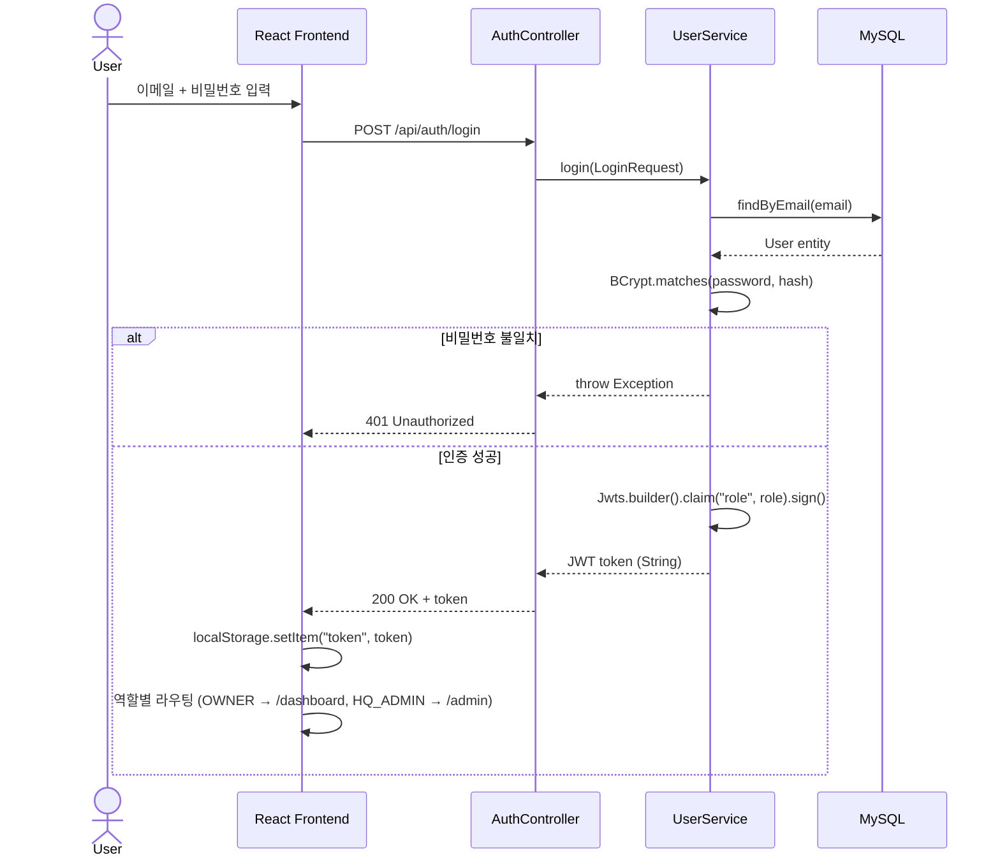
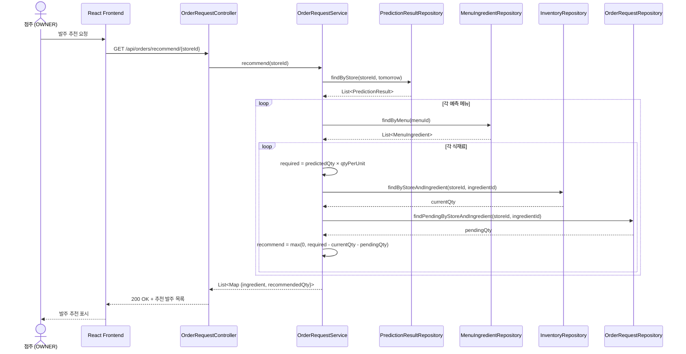
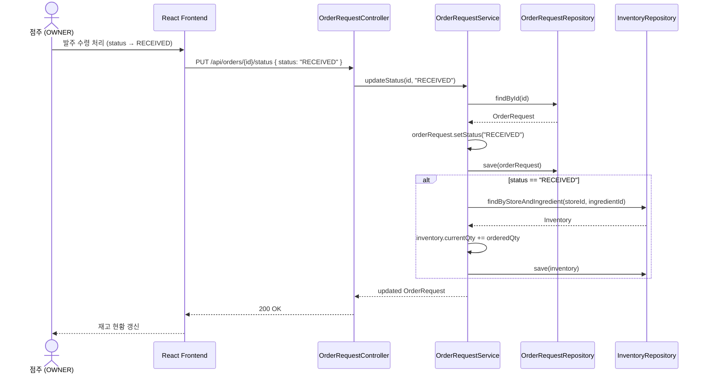

# FoodGuard - 시퀀스 다이어그램

## 1. AI 수요 예측 트리거 흐름

```mermaid
sequenceDiagram
    actor Owner as 점주 (OWNER)
    participant FE as React Frontend
    participant PC as PredictionController
    participant PS as PredictionService
    participant RT as RestTemplate
    participant AI as Python AI Service
    participant DB as TiDB
    participant PRR as PredictionResultRepository

    Owner->>FE: "AI 예측 실행" 버튼 클릭
    FE->>PC: POST /api/predictions/{storeId}/trigger
    PC->>PS: triggerPrediction(storeId)
    PS->>RT: POST http://localhost:8000/api/predict/store/{storeId}
    RT->>AI: (본문 없음, storeId만)

    AI->>DB: 전체 매장×메뉴 SALES_DATA, SALES_DAY_FLAG,<br/>STORE_EVENT_NOTE, MENU_INGREDIENT 조회
    AI->>AI: 기상청 7일 예보(예측용), Open-Meteo 과거 날씨(학습용)
    AI->>AI: 영업일 달력 정렬, 피처 생성<br/>(weekday lag_7/14, store_dow_ratio, 특이사항 배율)
    alt 전체 학습 행 >= MIN_DATA_POINTS
        AI->>AI: 글로벌 XGBoost 학습 (요청당 1회, 모든 메뉴 공유)<br/>+ 식자재 7일 기준 safety_factor 계산
    else 학습 행 부족
        AI->>AI: 요일 평균
    end
    loop 매장의 활성 메뉴마다
        AI->>AI: max(마지막 판매일, 오늘) 다음 날부터 7일 예측 (휴무일은 0)
        AI->>DB: PREDICTION_RESULT 미래분 삭제 후 INSERT
    end

    AI-->>RT: { status, store_id, menus_predicted }
    RT-->>PS: Map
    PS-->>PC: Map { status, message, storeId }
    PC-->>FE: 200 OK
    FE->>PC: GET /api/predictions/{storeId}
    PC->>PS: getPredictions(storeId)
    PS->>PRR: findByStore_IdAndPredictionDateGreaterThanEqual...
    PRR-->>PS: List<PredictionResult>
    PS-->>FE: 예측 목록
    FE-->>Owner: 예측 차트 업데이트
```

## 2. 로그인 및 JWT 인증 흐름

```mermaid
sequenceDiagram
    actor User
    participant FE as React Frontend
    participant AC as AuthController
    participant US as UserService
    participant DB as MySQL

    User->>FE: 이메일 + 비밀번호 입력
    FE->>AC: POST /api/auth/login
    AC->>US: login(LoginRequest)
    US->>DB: findByEmail(email)
    DB-->>US: User entity
    US->>US: BCrypt.matches(password, hash)
    alt 비밀번호 불일치
        US-->>AC: throw Exception
        AC-->>FE: 401 Unauthorized
    else 인증 성공
        US->>US: Jwts.builder().claim("role", role).sign()
        US-->>AC: JWT token (String)
        AC-->>FE: 200 OK + token
        FE->>FE: localStorage.setItem("token", token)
        FE->>FE: 역할별 라우팅 (OWNER → /dashboard, HQ_ADMIN → /admin)
    end
```

## 3. 주문 추천 흐름

```mermaid
sequenceDiagram
    actor Owner as 점주 (OWNER)
    participant FE as React Frontend
    participant ORC as OrderRequestController
    participant ORS as OrderRequestService
    participant PRR as PredictionResultRepository
    participant MIR as MenuIngredientRepository
    participant INV as InventoryRepository
    participant ORR as OrderRequestRepository

    Owner->>FE: 발주 추천 요청
    FE->>ORC: GET /api/orders/recommend/{storeId}
    ORC->>ORS: recommend(storeId)

    ORS->>PRR: findByStore(storeId, tomorrow)
    PRR-->>ORS: List<PredictionResult>

    loop 각 예측 메뉴
        ORS->>MIR: findByMenu(menuId)
        MIR-->>ORS: List<MenuIngredient>

        loop 각 식재료
            ORS->>ORS: required = predictedQty × qtyPerUnit
            ORS->>INV: findByStoreAndIngredient(storeId, ingredientId)
            INV-->>ORS: currentQty
            ORS->>ORR: findPendingByStoreAndIngredient(storeId, ingredientId)
            ORR-->>ORS: pendingQty
            ORS->>ORS: recommend = max(0, required - currentQty - pendingQty)
        end
    end

    ORS-->>ORC: List<Map {ingredient, recommendedQty}>
    ORC-->>FE: 200 OK + 추천 발주 목록
    FE-->>Owner: 발주 추천 표시
```

## 4. 발주 수령 → 재고 자동 반영 흐름

```mermaid
sequenceDiagram
    actor Owner as 점주 (OWNER)
    participant FE as React Frontend
    participant ORC as OrderRequestController
    participant ORS as OrderRequestService
    participant ORR as OrderRequestRepository
    participant INV as InventoryRepository

    Owner->>FE: 발주 수령 처리 (status → RECEIVED)
    FE->>ORC: PUT /api/orders/{id}/status { status: "RECEIVED" }
    ORC->>ORS: updateStatus(id, "RECEIVED")
    ORS->>ORR: findById(id)
    ORR-->>ORS: OrderRequest

    ORS->>ORS: orderRequest.setStatus("RECEIVED")
    ORS->>ORR: save(orderRequest)

    alt status == "RECEIVED"
        ORS->>INV: findByStoreAndIngredient(storeId, ingredientId)
        INV-->>ORS: Inventory
        ORS->>ORS: inventory.currentQty += orderedQty
        ORS->>INV: save(inventory)
    end

    ORS-->>ORC: updated OrderRequest
    ORC-->>FE: 200 OK
    FE-->>Owner: 재고 현황 갱신
```
